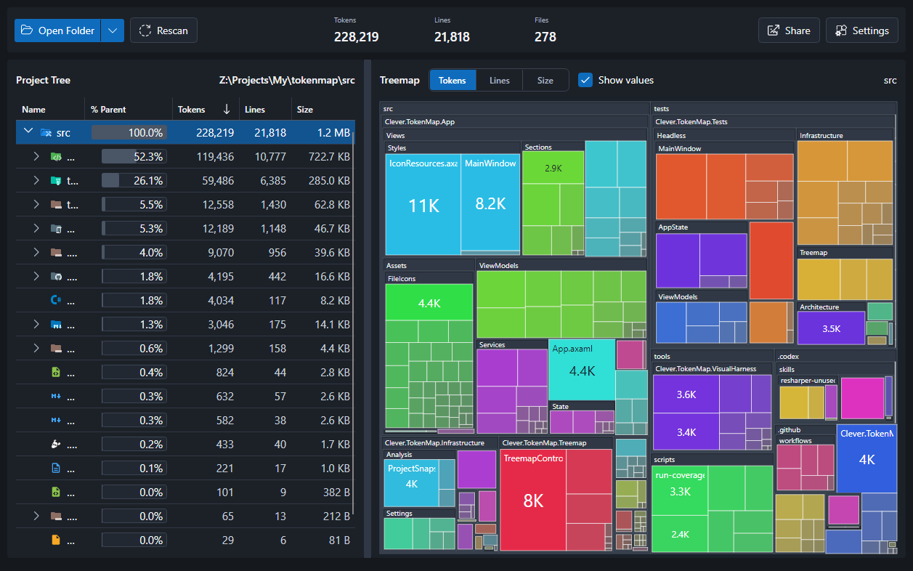

# TokenMap

TokenMap is a desktop app for quickly finding the parts of a local codebase that carry the most structural risk or are most worth refactoring first.



## Why TokenMap?

- See which folders and files actually dominate a repository.
- Find refactor candidates before cleanup, decomposition, or architecture work.
- Estimate which parts of a codebase will cost the most tokens in LLM workflows.

## Metrics

- Basic: Tokens, non-empty lines, file size.
- Derived: internal Structural Risk, product-facing Refactor Priority.
- Syntax-aware metrics currently cover C#, TypeScript, JavaScript, Python, Go, Java, PHP, and Rust.

## How It Works

- TokenMap scans a local folder into one snapshot.
- `.gitignore`, global excludes, and folder excludes decide what gets in.
- Only included files are measured and shown.
- Metrics are computed locally, and local git history can add extra change-pressure signals to Refactor Priority.
- Fully offline: no code is uploaded or sent to external services.

> [!NOTE]
> Token counts are computed locally with the `o200k_base` tokenizer via `Microsoft.ML.Tokenizers`.
> They are useful for comparing files and folders inside the same repository, but should not be treated as exact billing or context-window numbers for every model.

## Install

The latest release is available in [GitHub Releases](https://github.com/etechlead/token-map/releases).

### Windows

- Installer: download the Windows setup from the latest release and run it. It installs per-user and does not require administrator rights.
- Portable: download the Windows portable archive, extract it, and launch TokenMap from the extracted folder.

### macOS

- DMG: download the macOS disk image from the latest release, open it, and drag `TokenMap.app` into `Applications`.
- Portable: download the macOS portable archive, extract it, and move `TokenMap.app` into `Applications`.

<details>
<summary>macOS: first launch for the unsigned build</summary>

TokenMap is currently distributed as an unsigned app, so macOS may block the first launch.

UI path:

1. Move `TokenMap.app` to `Applications`.
2. Try to open it once, then dismiss the warning.
3. Open `System Settings > Privacy & Security`.
4. Find the message about `TokenMap` being blocked and click `Open Anyway`.
5. Confirm the follow-up prompt and launch the app again.

Terminal alternative:

```bash
xattr -dr com.apple.quarantine /Applications/TokenMap.app
```

Then launch `TokenMap.app` again.
</details>

### Linux

- Debian package:

```bash
cd ~/Downloads
sudo apt install ./<downloaded-package>.deb
tokenmap
```

- Portable: download the Linux portable archive, extract it, and run the included launcher from the extracted folder.

## Build From Source

Prerequisite: .NET SDK `10.0.201` or newer in the same feature band.

```powershell
dotnet restore Clever.TokenMap.sln
dotnet build Clever.TokenMap.sln
dotnet run --project .\src\Clever.TokenMap.App\Clever.TokenMap.App.csproj
```

Run tests:

```powershell
dotnet test Clever.TokenMap.sln --no-build
```

For repo conventions and architecture details, see `docs/architecture.md` and `docs/workflow.md`.

## Tech Stack

- .NET 10
- C#
- Avalonia
- CommunityToolkit.Mvvm
- Microsoft.ML.Tokenizers

## License

TokenMap is available under the [MIT License](LICENSE).
